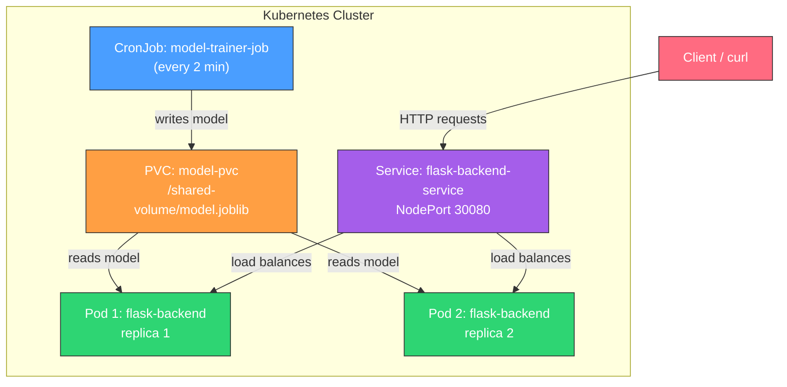

# MLIP Kubernetes Lab — Write-Up & Demo Guide

---

## Task 1: Continuous Model Training with Kubernetes CronJobs

### MLIP Concepts

**Continuous Training** is a core MLOps practice where models are retrained on a regular schedule to adapt to data drift, concept drift, and changing user behavior. Without continuous training, a deployed model's accuracy degrades over time as the real-world data distribution shifts away from the original training data.

**Why Kubernetes CronJobs?** In production ML systems, training pipelines must be:
- **Automated** — no manual intervention to trigger retraining
- **Scheduled** — run at predictable intervals (hourly, daily, weekly)
- **Isolated** — training workloads shouldn't interfere with serving workloads
- **Fault-tolerant** — failed training runs should retry automatically

Kubernetes CronJobs provide all of this out of the box. They are modeled after Unix cron, scheduling Jobs at specified intervals. Key configuration:
- `schedule: "*/2 * * * *"` — runs every 2 minutes (for demo; production would be less frequent)
- `concurrencyPolicy: Forbid` — prevents overlapping training runs
- `restartPolicy: OnFailure` — automatically retries failed training jobs

**Shared PersistentVolumeClaim (PVC):** The trained model is saved to `/shared-volume/model.joblib` on a PVC (`model-pvc`). This volume is shared between the trainer CronJob (read-write) and the backend inference pods (read-only), decoupling training from serving.

### Implementation

In `model_trainer.py`, we train a `RandomForestRegressor` on synthetic user engagement data:

```python
model = RandomForestRegressor(n_estimators=100, random_state=42)
model.fit(X, y)
```

The model is serialized along with metadata (feature names, training timestamp) and saved to the shared volume.

### How to Demo for the TA

**1. Show the CronJob is running:**
```bash
kubectl get cronjobs
```
Expected output:
```
NAME                SCHEDULE      SUSPEND   ACTIVE   LAST SCHEDULE   AGE
model-trainer-job   */2 * * * *   False     0        58s             3m
```

**2. Show completed training jobs:**
```bash
kubectl get jobs
```
Expected output — multiple jobs completing over time:
```
NAME                         STATUS     COMPLETIONS   DURATION   AGE
model-trainer-job-29614512   Complete   1/1           59s        2m58s
model-trainer-job-29614514   Complete   1/1           5s         57s
```

**3. Show the training logs from a specific job:**
```bash
kubectl logs -f job/<job-name>
```
Expected log:
```
[2026-04-22 15:20:35] Starting model training
[2026-04-22 15:20:36] Model trained and saved
```

**4. Show the model is being picked up by the backend (via model-info):**
```bash
curl http://127.0.0.1:<port>/model-info
```
Note how `last_training_time` updates every 2 minutes as new models are trained.

---

## Task 2: Backend Inference Service & Load Balancing

### MLIP Concepts

**Model Serving** is the process of making a trained ML model available for inference via an API. In production, this involves:
- Loading the latest model from storage
- Exposing prediction endpoints
- Handling concurrent requests efficiently
- Scaling horizontally to meet demand

**Horizontal Scaling with Replicas:** Our deployment runs `replicas: 2`, meaning Kubernetes creates two identical pods running the same Flask backend. This provides:
- **High availability** — if one pod crashes, the other continues serving
- **Increased throughput** — requests are distributed across pods
- **Zero-downtime deployments** — new pods start before old ones terminate

**Kubernetes Load Balancing:** The `flask-backend-service` (type: `NodePort`) acts as a stable endpoint that routes traffic to the backend pods. Kubernetes uses **kube-proxy** to implement load balancing:

- **iptables mode** (default): kube-proxy programs iptables rules that randomly distribute packets across the backend pods. Each new TCP connection is routed to a randomly selected pod with roughly equal probability.
- **IPVS mode** (alternative): Uses Linux IPVS for more sophisticated load balancing algorithms (round-robin, least connections, etc.)

The `Service` abstraction provides a single stable IP address (`ClusterIP: 10.98.22.154`) and DNS name (`flask-backend-service`) that maps to the set of pod IPs. When a pod dies or is replaced, the Service automatically updates its endpoint list — clients never need to track individual pod IPs.

**Periodic Model Reloading:** The backend runs a daemon thread that reloads the model from the shared volume every 30 seconds. This means when the CronJob produces a new model, all backend replicas pick it up without requiring a restart.

### Implementation

In `backend.py`, the prediction endpoint uses the loaded model:

```python
engagement_score = float(current_model.predict(features)[0])
```

### How to Demo for the TA

**1. Show the deployment and two replicas:**
```bash
kubectl get pods -l app=flask-backend
```
Expected:
```
NAME                                        READY   STATUS    RESTARTS   AGE
flask-backend-deployment-76d5bcf5b5-4kn8h   1/1     Running   0          2m
flask-backend-deployment-76d5bcf5b5-8pvmv   1/1     Running   0          2m
```

**2. Show load balancing via the `host` field:**

Run multiple requests and observe the `host` field changing:
```bash
curl http://127.0.0.1:<port>/model-info
curl http://127.0.0.1:<port>/model-info
curl http://127.0.0.1:<port>/model-info
```

You'll see responses from different hosts:
```json
{"host": "flask-backend-deployment-76d5bcf5b5-4kn8h", ...}
{"host": "flask-backend-deployment-76d5bcf5b5-8pvmv", ...}
{"host": "flask-backend-deployment-76d5bcf5b5-4kn8h", ...}
```

**3. Test the predict endpoint:**
```bash
curl --location --request POST 'http://127.0.0.1:<port>/predict' \
  --header 'Content-Type: application/json' \
  --data-raw '{
    "avg_session_duration": 30,
    "visits_per_week": 14,
    "response_rate": 4,
    "feature_usage_depth": 6,
    "user_id": 34
  }'
```

### TA Questions & Answers

> **Q: How can you verify that Kubernetes is load-balancing requests across replicas?**

By examining the `host` field in the JSON response body. Each pod has a unique hostname (its pod name). When making multiple requests to the same Service endpoint, the `host` field alternates between the two pod names (e.g., `...4kn8h` and `...8pvmv`), proving that Kubernetes is distributing requests across both replicas.

> **Q: How does Kubernetes route traffic to the replicas of a service?**

Kubernetes routing works through several layers:

1. **Service Discovery:** When we create a `Service`, Kubernetes assigns it a stable `ClusterIP` and registers it in cluster DNS. All requests to `flask-backend-service:5001` resolve to this ClusterIP.

2. **Endpoint Tracking:** The Kubernetes control plane watches for pods matching the Service's `selector` (`app: flask-backend`) and maintains an `Endpoints` object listing all healthy pod IPs.

3. **kube-proxy:** On each node, kube-proxy watches Services and Endpoints, and programs either:
   - **iptables rules** (default): Use `DNAT` rules with random probability to distribute connections across pod IPs. For 2 pods, each gets ~50% probability.
   - **IPVS rules**: Use the Linux kernel's IPVS module for algorithms like round-robin, least-connections, or weighted distribution.

4. **NodePort:** Since our Service type is `NodePort` (port `30080`), the same kube-proxy rules apply when traffic arrives at any node's port 30080. It's forwarded to one of the backend pod IPs.

The key insight is that load balancing happens at the **connection level** (L4), not per-request. Each new TCP connection is independently routed to a random pod.

---

## Task 3: Container Lifecycle Hooks & Graceful Shutdown

### MLIP Concepts

**Graceful Shutdown** is critical for ML serving systems because:
- In-flight prediction requests should complete, not be dropped
- Model state or caches may need to be flushed
- The service should deregister from load balancers before stopping
- Metrics and logs should be finalized

**Kubernetes Pod Termination Sequence:**

When Kubernetes decides to terminate a pod (e.g., during a rolling update), it follows this sequence:

```
1. Pod is set to "Terminating" state
2. Pod is removed from Service endpoints (no new traffic)
3. preStop hook executes (if defined)
4. preStop hook completes (or times out)
5. SIGTERM is sent to PID 1 in the container
6. Grace period countdown begins (default: 30s)
7. If the process hasn't exited, SIGKILL is sent
```

> [!IMPORTANT]
> Steps 2 and 3 happen **concurrently**. The preStop hook gives the application time for the endpoint removal to propagate, preventing requests from being routed to a terminating pod.

**Our preStop Hook Implementation:**

```yaml
lifecycle:
  preStop:
    exec:
      command: ["sh", "-c", "kill -USR1 1; sleep 5"]
```

This does two things:
1. **`kill -USR1 1`** — Sends `SIGUSR1` to the Python process (PID 1), which triggers a log message: *"preStop signal received (SIGUSR1). Host preparing for shutdown..."*
2. **`sleep 5`** — Waits 5 seconds before the hook completes, giving time for:
   - The Service endpoint removal to propagate
   - In-flight requests to complete
   - Any cleanup tasks to finish

After the preStop hook completes, Kubernetes sends `SIGTERM`, and our handler logs *"SIGTERM received. Host being terminated..."* then exits.

### How to Demo for the TA

**1. Start watching logs in one terminal:**
```bash
kubectl logs -l app=flask-backend -f --tail=0
```

**2. In another terminal, trigger a rollout restart:**
```bash
kubectl rollout restart deployment/flask-backend-deployment
```

**3. Observe the log output showing the shutdown sequence:**

```
preStop signal received (SIGUSR1). Host preparing for shutdown: flask-backend-deployment-6dfcc88589-xk6zp. Last model training time: 2026-04-22T15:42:04.476268
preStop signal received (SIGUSR1). Host preparing for shutdown: flask-backend-deployment-6dfcc88589-rr5z2. Last model training time: 2026-04-22T15:42:04.476268
SIGTERM received. Host being terminated: flask-backend-deployment-6dfcc88589-xk6zp. Last model training time: 2026-04-22T15:42:04.476268
```

This clearly shows: **preStop (SIGUSR1) runs BEFORE SIGTERM**, with a 5-second gap between them.

### TA Questions & Answers

> **Q: When does the preStop hook run relative to Kubernetes sending SIGTERM?**

The preStop hook runs **before** SIGTERM. As demonstrated in our logs:

1. First, we see `"preStop signal received (SIGUSR1)"` — this is our preStop hook executing
2. Then, after the hook completes (including the 5-second sleep), we see `"SIGTERM received"` — this is Kubernetes terminating the container

The full sequence is: Pod marked Terminating → endpoints removed (async) → **preStop hook executes** → preStop completes → **SIGTERM sent** → grace period → SIGKILL (if needed).

> **Q: Explain the graceful shutdown sequence.**

1. **Kubernetes decides to terminate the pod** (e.g., during a rolling update via `kubectl rollout restart`)
2. **Pod enters `Terminating` state** — simultaneously, the pod is removed from Service endpoints so no new requests are routed to it
3. **preStop hook runs** — our hook sends `SIGUSR1` to the app (which logs the shutdown preparation), then sleeps 5 seconds to allow in-flight requests to drain
4. **SIGTERM is sent** — after the preStop hook finishes, Kubernetes sends SIGTERM to PID 1. Our handler logs the termination and calls `sys.exit(0)`
5. **Grace period** — if the process doesn't exit within `terminationGracePeriodSeconds` (30s in our config), Kubernetes sends SIGKILL to force-kill it

> **Q: Describe one practical use case for lifecycle hooks.**

**ML Model Serving — Request Draining and State Persistence:**

In a production ML inference service, a preStop hook can:

1. **Signal the application to stop accepting new requests** (return 503 on health checks, causing the load balancer to stop sending traffic)
2. **Wait for in-flight predictions to complete** — ML inference can be computationally expensive (e.g., large transformer models taking seconds per request). Abruptly killing the process would cause clients to receive errors for partially-completed predictions
3. **Flush prediction logs and metrics** — write any buffered prediction logs, model performance metrics, or A/B testing data to persistent storage before the pod dies
4. **Save model cache or warm-up state** — if the model uses feature caches or preprocessed data structures, these can be serialized so the next pod starts faster

Other practical use cases include:
- **Database connection draining** — close connections gracefully to avoid connection pool exhaustion
- **Deregistering from service discovery** — notify external registries (Consul, Eureka) that this instance is going away
- **Checkpoint saving** — for long-running training jobs, save a checkpoint so training can resume from the last state instead of starting over

---

## Architecture Overview



**Data Flow:**
1. CronJob trains a new model every 2 minutes → saves to PVC
2. Backend pods reload the model from PVC every 30 seconds
3. Clients send requests to the Service → kube-proxy routes to a pod
4. On shutdown, preStop hook drains requests → SIGTERM terminates gracefully
